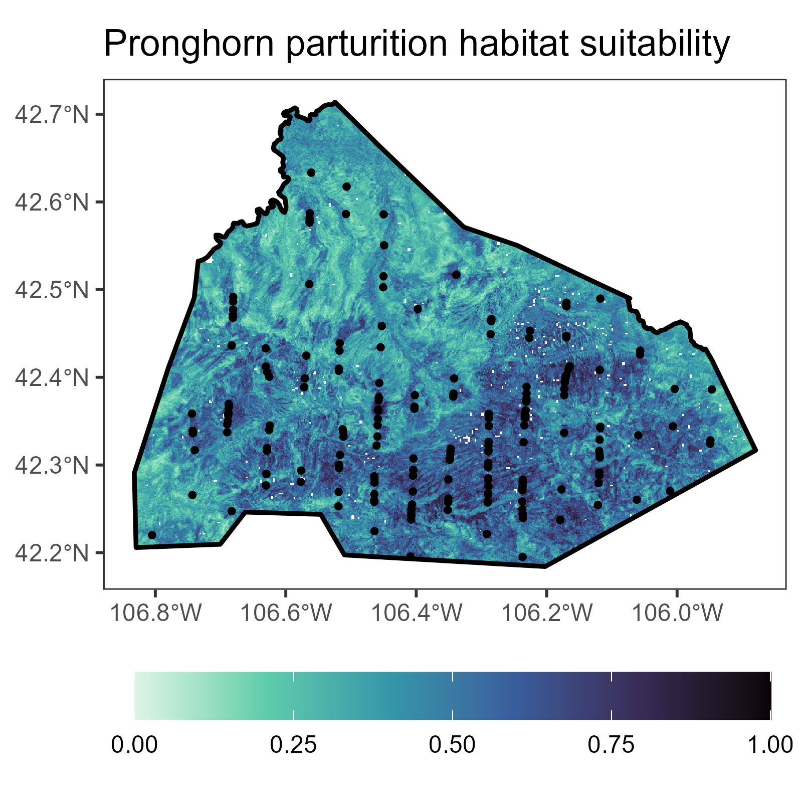

# Overview

Data and code to supplement Shapiro et al. 202X (in prep).

*INSERT CITATION*

The contents of this repo illustrate the use of the [`MerkleLabGIS`](https://github.com/jmerkle1/MerkleLabGIS) package coupled with pronghorn monitoring data collected by the Wyoming Game and Fish Department to create a habitat-suitability map for pronghorn parturition habitat based on a resource selection function (RSF) fit using Random Forests.

# Contents
## Scripts
- **script_01_prepCovars.R**:  Prep covariate rasters using `MerkleLabGIS` package
- **script_02_prepPoints.R**:  Prep presence and (pseudo-) absence points
- **script_03_fitRSF.R**:  Fit RSF using Random Forests
- **script_04_makeMap.R**:  Create predicted habitat suitability map

## Input Data
- **StudyArea_AllOwnership.kml**:  Spatial polygon - the study area, a portion of the Medicine Bow pronghorn herd unit
- **StudyArea_Public.kml**:  Spatial polygon - public lands within the study area
- **SurveyData_TransectLines.kml**:  Spatial lines -  transects surveyed during aerial survey for pronghorn in spring 2023
- **SurveyData_PronghornPoints.kml**:  Spatial points - approximate location of pronghorn groups detected during aerial survey, subject to location error of approximately +/- 300 m

## Prepped Data
- **CovarRasters.rds**:  R object - raster stack with layer for each of 22 predictor variables used to model pronghorn habitat suitability, output of script 01
- **Pronghorn_PresAbs.rds**:  R object - spatial points of pronghorn group locations (n = 188) and available locations (pseudo-absence, n = 188), output of script 02
- **Pronghorn_RandomForests_Model.rds**:  R object - Random Forests RSF model fit to pronghorn data and covariates, output of script 03

## Output
- **Covar_xxx.png**:  Map image for each of 22 predictor variables (covariate rasters), output of script 1
- **HabitatSuitability.png**:  Map image of pronghorn habitat suitability, output of script 04
- **HabitatSuitability_withPresPoints.png**:  Map image of pronghorn habitat suitability including locations of observed pronghorn (presence points), output of script 04 (shown below)
- **PresAbs.png**:  Map image of surveyed transects, locations of observed pronghorn, and available locations (pseudo-absence), output of script 02.
- **RF_xxx.xxx**:  Various outputs indicating Random Forests model performance, output of script 03

# Data Sensitivity
Pronghorn locations on privately owned land have been omitted due to data sensitivity and sharing restrictions.  Land ownership was determined using a GIS layer from the Bureau of Land Management (BLM) from 2022.

# License
Not defined.
